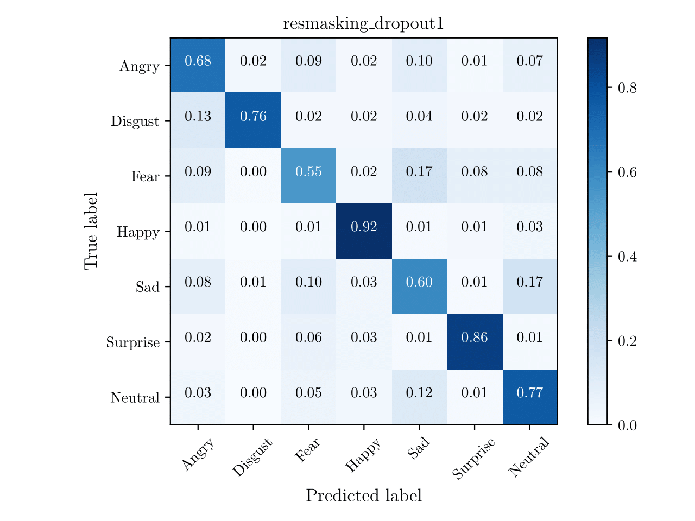

# Facial expression Recognition using ensemble of CNNs

### Table of Contents
- <a href='###FER2013'>Benchmarking on FER2013</a>
- <a href='###JAFFE'>Benchmarking on JAFFE</a>
- <a href='#install'>Installation</a>
- <a href='#datasets'>Download datasets</a>
- <a href='#train_fer'>Training on FER2013</a>
- <a href='#eval'>Evaluation results</a>

## Benchmarks
### FER2013

Model | Accuracy |
---------|--------|
[VGG19](www.google.com)  | 70.77|
[EfficientNet_b2b](www.google.com)|70.83|
[Googlenet](www.google.com) | 71.97
[Resnet34](www.google.com) | 72.42
[Inception\_v3](www.google.com) | 72.72
[Resnet50](www.google.com) | 72.86
[Cbam\_Resnet50](www.google.com) | 72.95
[Bam\_Resnet50](www.google.com) | 73.14
[Densenet121](www.google.com) | 73.16
[Resnet152](www.google.com) | 73.22
[Resnet101](www.google.com) | 74.06
[ResMaskingNet](www.google.com) | 74.14
[ResMaskingNet + 6](www.google.com) | 76.82

### JAFFE

Model | Accuracy |
---------|--------|
[EfficientNet_b2b](www.google.com)|90|
[Resnet18](www.google.com) | 91.42
[Resnet101](www.google.com) | 92.86
[Resnet50](www.google.com) | 94.28
[Cbam\_Resnet50](www.google.com) | 94.29
[ResMaskingNet](www.google.com) | 97.1
[Ensemble of above CNNs](www.google.com) | 98.2

### CK+

Model | Accuracy |
---------|--------|
[Resnet18](www.google.com) | 96.631
[Densenet121](www.google.com)  |97.573|
[VGG19](www.google.com)  | 98.058|
[Resnet101](www.google.com) | 98.544
[ResNet50_pretrainedvgg](www.google.com) | 98.544
[EfficientNet_b2b](www.google.com)|100|
[Resnet34](www.google.com) | 100
[Cbam\_Resnet50](www.google.com) | 100
[ResMaskingNet](www.google.com) | 100

<p id="install"></p>


## Installation
- Install [PyTorch](http://pytorch.org/) by selecting your environment on the website and running the appropriate command.
- Clone this repository and install package [prerequisites](#prerequisites) below.
- Then download the dataset by following the [instructions](#datasets) below.


### Prerequisites

* Python 3.6+
* PyTorch 1.3+
* Torchvision 0.4.0+
* [requirements.txt](requirements.txt)


<p id="datasets"></p>


## Datasets

- [FER2013 Dataset](https://drive.google.com/drive/folders/1zSTESJHLTzwLy5GbJd0984fQyKOR8nOg?usp=sharing) (locate it in ```saved/data/fer2013``` like ```saved/data/fer2013/train.csv```)
- [JAFFE Dataset](https://drive.google.com/drive/folders/1V00bMSZFdE9rc1Ujc2MsaktWiCWcb8tX?usp=sharing) (locate it in ```saved/data/jaffe``` like ```saved/data/jaffe/train.csv```)

## Training on FER2013

- To train network, you need to specify model name and other hyperparameters in config file (located at configs/\*) then ensure it is loaded in main file, then run training procedure by simply running main file, for example:

```Shell
python main_fer.py  # Example for fer2013_config.json file
```

- The best checkpoints will chosen at term of best validation accuracy, located at ```saved/checkpoints```
- The TensorBoard training logs are located at ```saved/logs```, to open it, use ```tensorboard --logdir saved/logs/```

- By default, it will train `alexnet` model, you can switch to another model by editing `configs/fer2013\_config.json` file (to `resnet18` or `cbam\_resnet50` or my network `resmasking\_dropout1`.

  Follow similar process for JAFFE dataset

## Evaluation

Below is an example for generating a striking confusion matrix writing things in latex.

(Read [this article](https://matplotlib.org/3.1.1/tutorials/text/usetex.html) for more information, there will be some bugs if you blindly run the code without reading).

```Shell
python ./Visualization/gen_confusion_matrix.py
```

<p align="center">

</p>

Below is an example, to generate salient maps for jaffe images to find most import parts of the image used by the model for prediction.

```Shell
python ./Visualization/gen_salientmap.py
```

Below is an example, to generate gradCAM visualization to find most import parts of the image used by the model for prediction.

```Shell
python ./Visualization/gradCAM_resmasking.py
```


## Ensemble method

I used no-weighted sum avarage ensemble method to fuse 7 different models together, to reproduce results, you need to do the following steps:

1. Download all needed trained weights and located on ```./saved/checkpoints/``` directory.  Link to download can be found on Benchmarking section.
2. Edit file ```gen_results``` and run it to generate result offline for **each** model.
3. Run ```gen_ensemble.py``` file to generate accuracy for example methods.

## Documentation

[documentation](https://drive.google.com/file/d/1t5RDEYSFVQ0NgLf8DPgPNxizbKdrRmOc/view?usp=sharing)
[video1](https://drive.google.com/file/d/1ULS74mXyXUikQRxkLbJYd_NVIwuO03-3/view?usp=sharing)
[video2](https://drive.google.com/file/d/1BQu_PUiSaHytONIfphx4J2pdIljom27z/view?usp=sharing)

## References
